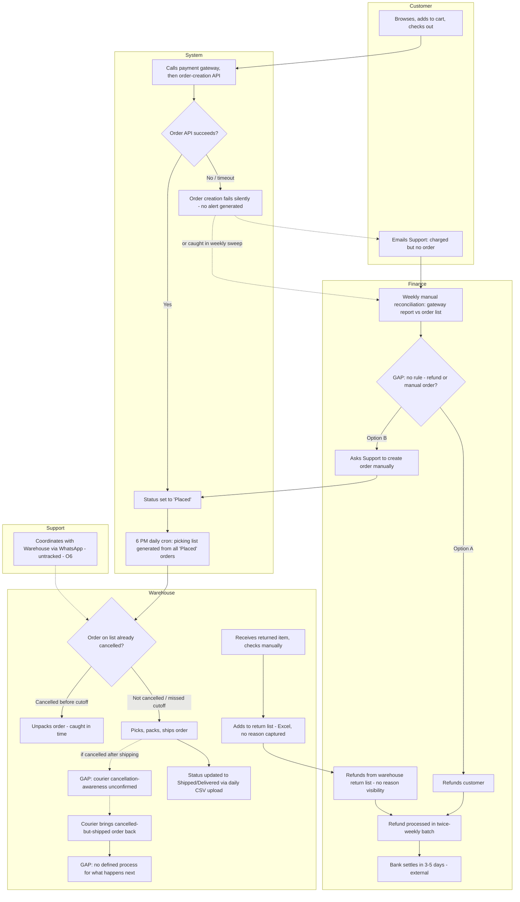

# As-Is Process — OMS v2

## Purpose
Document how the order lifecycle actually works today, across four key sub-flows, before any redesign. Built from stakeholder interviews (Support, Warehouse, Finance, Engineering) — not assumptions.

## Combined As-Is Diagram (Mermaid)

## Sub-Flow 1: Happy Path (Narrative)
A customer browses ShopKart's catalog and completes payment at checkout. If the payment succeeds, the system automatically creates the order and sets its status to "Placed." From here, the process depends entirely on a daily batch job: a cron job runs once a day at 6 PM and pulls every order currently sitting in "Placed" status into a picking list. Only once an order appears on this list does the warehouse team pick and pack it — meaning an order placed just after 6 PM can sit untouched for nearly a full day before any physical action begins. Once packed, the order is dispatched to the courier, and a warehouse team member manually updates its status to "Shipped" via a daily CSV upload — the same manual, once-a-day mechanism is used again when the courier confirms delivery, updating the status to "Delivered."

## Sub-Flow 2: Payment-Without-Order (Narrative)
A customer completes checkout and payment succeeds, but the order-creation step fails — typically due to the order API timing out. Because the system doesn't retry this call or listen for payment confirmation webhooks, the failure is silent: nothing alerts anyone that a payment has been taken with no corresponding order. This mismatch surfaces in one of two ways — either the customer notices and emails Support, or Finance catches it during a weekly manual reconciliation of the payment gateway report against the order list. Once identified, Finance resolves the case by either refunding the customer or asking Support to manually create the order — but there is no defined rule for which action applies, so the outcome today depends on whichever option is acted on first, with no consistent logic behind the choice.

## Sub-Flow 3: Cancellation-After-Shipment (Narrative)
A picking list is generated by a cron job that runs daily at 6 PM, pulling all orders currently in "Placed" status. Cancelled orders are meant to be excluded from this list, since they carry a different status — but the exclusion only works if the cancellation happens before the 6 PM cron runs. If an order is cancelled before the cutoff, it is correctly excluded and never picked. If it's cancelled after, there is no real-time alert, so it gets packed, shipped, and only discovered as cancelled when the courier brings it back — at which point the warehouse has no defined process for what to do with it.

**Gap:** whether cancellation status is ever communicated to the courier/logistics partner is unconfirmed by any interview. If it isn't, a cancelled-but-shipped order could simply be delivered as normal, with the customer keeping the item and no mechanism ever surfacing the mismatch — a more severe, silent version of the documented "courier returns it" outcome.

## Sub-Flow 4: Returns/Refund (Narrative)
How a customer formally requests a return is not confirmed by any interview — this is an undocumented gap, not a defined process. At some point, the physical item reaches the warehouse, where it is checked manually, with no return reason or product condition captured anywhere in the system — even damaged items are not consistently distinguished from resellable ones. The warehouse adds the item to a return list and sends it to Finance via Excel. Finance initiates a refund based solely on this list, with no visibility into why the item was returned or what condition it's in. The refund is processed in the next scheduled batch — Tuesday or Friday — after which the customer's bank takes a further 3-5 business days to settle the money, a timeline outside ShopKart's control.

## Identified Gaps (undocumented, not confirmed by any interview)
- **Return initiation mechanism** — how a customer starts a return request is unknown.
- **Courier cancellation-awareness** — whether couriers are informed of cancellations post-dispatch is unknown.
- **Post-return disposition** — what happens to a cancelled-and-returned item once it's back at the warehouse is undefined.
