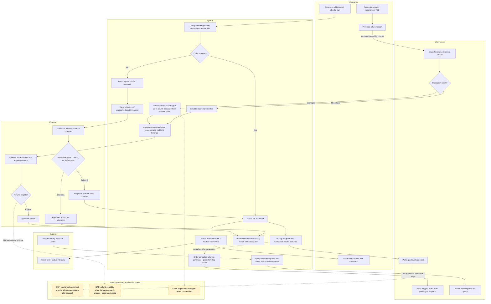

# To-Be Process: OMS v2 Phase 1

## Purpose
Shows how the order lifecycle will work after OMS v2 Phase 1, based on BR-01 to BR-07, FR-01 to FR-07, the Business Rules, and UC-01 to UC-05. Gaps that are still undecided are shown as open (yellow, dashed) rather than resolved by assumption.

## Combined To-Be Diagram (Mermaid)

## How to read this
- Solid arrows are decided, documented flow steps.
- Dotted arrows are branches that depend on a missed step or an unresolved question.
- Yellow dashed boxes are open gaps. They are carried forward honestly, not filled in.
- The Resolution path diamond in Finance (D2) is also open: the diagram shows both options because the default rule is still a pending business decision.

## What changed from As-Is

| Area | As-Is | To-Be |
|---|---|---|
| Order status | Shipped and Delivered updated manually by a daily CSV upload | Status updated within 1 hour of each event, visible to customer and internal teams (BR-02) |
| Payment without order | Silent failure; found by customer email or weekly Excel reconciliation | Mismatch logged, flagged, and Finance notified within 24 hours (BR-01) |
| Picking list | Generated once at 6 PM; late cancellations missed | Cancelled orders excluded at generation; late cancellations persistently flagged (BR-03) |
| Returns and stock | No stock increment logic; damaged items counted as sellable | Resellable restocked, damaged tracked separately (BR-04) |
| Return reason | Not captured | Captured at request, visible with inspection result to Finance (BR-05) |
| Refunds | Twice-weekly batch | Initiated individually within 1 business day of approval (BR-06) |
| Coordination | WhatsApp and manual Excel | Queries recorded against the order and retrievable (BR-07) |

## Gaps carried forward
1. Return-initiation mechanism (how a customer starts a return) is undefined.
2. Courier awareness of cancellation after dispatch is unconfirmed (P6a).
3. Refund eligibility depends on damage cause, and no policy or inspection process exists.
4. Disposal of damaged items is undecided.
5. Default resolution for payment-without-order (refund vs manual order) is undecided.
