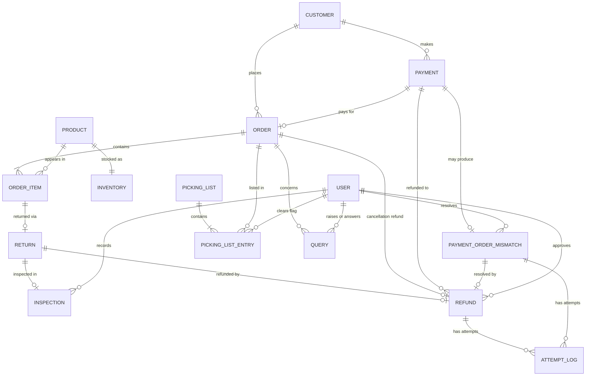

# Data Model (Logical ERD): OMS v2 Phase 1

## Purpose
A logical data model showing the business entities OMS v2 must hold, their attributes, and how they relate. It is deliberately logical: no data types, indexes, or database-specific choices. Each entity traces to a Functional Requirement, Business Rule, or NFR. Open gaps are not modelled, so nothing here decides something that is still undecided.

## Entity Relationship Diagram (Mermaid)

## How to read the notation
- `||` exactly one, `o|` zero or one, `|{` one or many, `o{` zero or many.
- Example: `CUSTOMER ||--o{ ORDER` means one Customer has zero or many Orders, and each Order has exactly one Customer.
- `PAYMENT ||--o| ORDER` means a Payment has zero or one Order. Zero is the payment-without-order mismatch case (P2).
- The links from USER are supporting links (who did what, per NFR-05). If the diagram feels crowded, they can be drawn off to one side.

## Entities and attributes

| Entity | Attributes | Traces to |
|---|---|---|
| Customer | Customer ID, Name, Contact details | UC-01 (customers contact Support) |
| Order | Order ID, Status (Placed / Processing / Shipped / Delivered / Cancelled), Status last-updated date/time, Placed date/time, Cancelled date/time | FR-02.1, FR-03.1, FR-03.2 |
| Order Item | Quantity, Price at purchase | FR-04, FR-05, FR-06 (refund amount) |
| Product | Product ID, Name | FR-04 |
| Inventory | Sellable count, Damaged count, Last updated date/time | FR-04.1, FR-04.2, O4 |
| Payment | Payment ID, Gateway transaction reference, Amount, Payment date/time, Payment status (as reported by gateway), Payment method | FR-01, assumption A1 |
| Payment-Order Mismatch | Mismatch ID, Detected / Flagged / Finance-notified date/times, Resolution (Refunded / Manual order / Unresolved), Resolved date/time, Resolved by | FR-01.1 to 01.3, UC-01 |
| Picking List | List ID, Generated date/time | FR-03.1 |
| Picking List Entry | Cancelled-after-generation flag, Flag cleared date/time, Cleared by | FR-03.2, US-05 |
| Return | Return ID, Return reason (write-once), Requested date/time, Received date/time, Return status (values TBD) | FR-05.1, BRule-05, BRule-06, UC-03 |
| Inspection | Inspection ID, Result (Resellable / Damaged), Inspected by, Inspection date/time | FR-04.1, BRule-02 |
| Refund | Refund ID, Source (Return / Pre-shipment cancellation / Payment-order mismatch), Amount, Approved by, Approved date/time, Initiated date/time, Refund status (Approved / Initiated / Failed) | FR-06.1, FR-06.2, BR-06, BRule-01, NFR-02, NFR-03 |
| Query | Query ID, Query text, Raised by, Raised date/time, Addressed to (team), Response, Responded by, Responded date/time, Resolution status, Resolved date/time | FR-07.1, NFR-04 |
| User (with Role) | User ID, Name, Role (Finance / Warehouse / Support / ...) | BRule-01, BRule-02, NFR-05 |
| Attempt Log | Attempt ID, Type (Refund initiation / Finance notification), Attempt date/time, Outcome (Success / Failure), Failure detail | NFR-02, NFR-03 |

## Constraints the model must enforce
- **One refund per case.** A Refund links to exactly one of: a Return, a cancelled Order, or a Payment-Order Mismatch. This is what prevents the duplicate refund in EC-04.
- **Return reason is write-once.** It cannot be edited or deleted after submission (BRule-06).
- **Order reaches Return through Order Item,** because a return concerns a specific item, not the whole order.
- **Inventory is per product,** with sellable and damaged counts held separately (FR-04.2).

## Deliberately not modelled (open gaps)
- How a customer initiates a return (P9a). No field exists until this is decided.
- Cause of damage on a returned item, and whether it affects refund eligibility.
- Disposal of damaged items (no "disposed" count in Inventory).
- Whether the courier is told about a cancellation after dispatch (P6a).
- Default resolution for a payment-order mismatch (the Resolution value stays "Unresolved" until a rule exists).
- Partial cancellations and partial returns, which were never scoped in.

## Assumptions to confirm with Engineering
- An order normally appears on one Picking List, but the model allows zero or many. Confirm whether an unpicked order can appear on the next day's list.
- Refund is "zero or one" per order for cancellations, which assumes full cancellations only.
- Refund status values are a proposal. Bank settlement is deliberately not tracked, because it is outside ShopKart's control.
- FR-06.1 says the system initiates a refund after approval, while BRule-01 says Finance initiates it. The model records the Finance user as the approver. The two requirement files should be aligned.
- A Return covers a whole Order Item (zero or one per item). If an item with quantity above 1 can be partly returned, this becomes zero or many, and partial returns would need to be scoped in first.

## Notes on Methodology
- Entities came from reading each FR and Use Case for the business nouns it needs, not from a blank page.
- Attributes with no lifecycle of their own were folded into their parent (return reason into Return, damaged count into Inventory, status into Order) rather than made separate entities.
- Inspection and Picking List Entry are separate entities on purpose: Inspection will gain fields once the damage-cause rule is decided, and the cancellation flag belongs to the link between a list and an order, not to either one.
